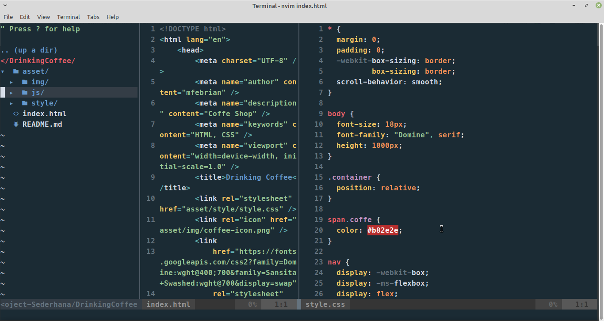

# Setup my personal Neovim

## Vim-Plugin-Manager

1. Vim-Plug

- https://github.com/junegunn/vim-plug

## Features

1. Colorscheme OceanicNext
- https://github.com/mhartington/oceanic-next

2. Lightline colorscheme wombat
- https://github.com/itchyny/lightline.vim

3. NerdTree
- https://github.com/preservim/nerdtree

4. Vim DevIcons
- https://github.com/ryanoasis/vim-devicons

5. Fuzzy Finder
- https://github.com/junegunn/fzf

6. Emmet
- https://github.com/mattn/emmet-vim

7. Prettier
- https://github.com/prettier/vim-prettier

8. Auto Pairs
- https://github.com/jiangmiao/auto-pairs

9. CSS color
- https://github.com/gko/vim-coloresque

10. Autcomplete
- https://github.com/neoclide/coc.nvim

11. Theme color for Fuzzy finder
- https://github.com/sharkdp/bat

12. Commentar code
- https://github.com/tpope/vim-commentary

13. Can give color for syntax code
- https://github.com/sheerun/vim-polyglot

14. Snippets
- https://github.com/SirVer/ultisnips
  - Short Description https://gist.github.com/mfebriann/a9d55a44a50647c3caecbc08c1cd654b

# Other Sources
1. Colorscheme FZF / Fuzzy Finder
- https://github.com/junegunn/fzf/wiki/Color-schemes
  - Short Description https://gist.github.com/mfebriann/29263ae9314d0244335e98d138b3b6a5

2. Mapping switch between tabs
- https://superuser.com/questions/410982/in-vim-how-can-i-quickly-switch-between-tabs
  - Short Description https://gist.github.com/mfebriann/b1d1a8462a9bec506511d6dd97f9bd2e

3. Block tabs
- https://vim.fandom.com/wiki/Shifting_blocks_visually#Mappings

4. Colorscheme left panel FZF / Fuzzy Finder
- https://github.com/junegunn/fzf/wiki/Color-schemes

# Controls

- Ctrl + b to open NerdTree
- Ctrl + f to find NerdTree
- Ctrl + e to find files with FZF
- Ctrl + g to find string / text with F2F // Requirement install ripgrep
- Ctrl + w to open new window
- Ctrl + k to move left window split
- Ctrl + l to move right window split
- Ctrl + s to Autocomplete
- Ctrl + x to Cut on _Visual Line Mode_
- Ctrl + v to Paste  on _Insert Mode_
- Ctrl + c to Copy  on _Visual Line Mode_
- Ctrl + a to Select all text on _Normal Mode_
- Show emmet press `,,` double comma
- Automatically add close bracket
- Switch tabs using `Ctrl` + `Right` arrow keyboard for Next tab
- Switch tabs using `Ctrl` + `Left` arrow keyboard for Previous tab
- Switch tabs using `\1` in order tabs, if switch last tabs using `\0`
- Give commentar one line using `\c`
- Give commentar select text using `Ctrl` + `\`
- Hide code select `\h`
- Show code select `\s`, switch insert mode can also
- Next tab snippets `Ctrl` + `x`
- Previous tab snippets `Ctrl` + `z`

# Shortcut

1. Rename file or directory with nvim or vim
- `\ls | nvim -` or `\ls | vim -` 
  - change with command mv, then save with command `:w !sh` then `q!`
2. Directory configuration snippets `Ultisnips`
3. How to check map-overview map-modes, `:h map.txt`
4. How to check key-notation `:h key-notation`

