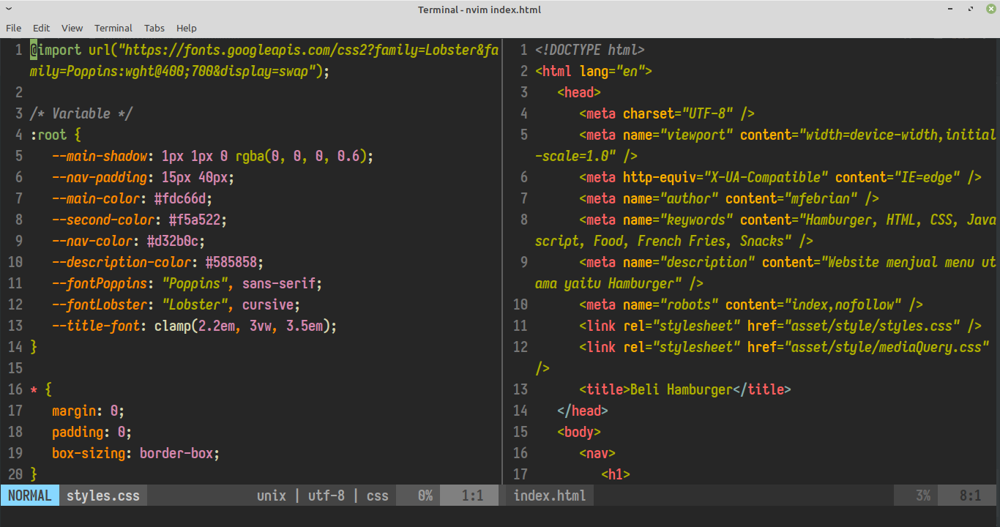
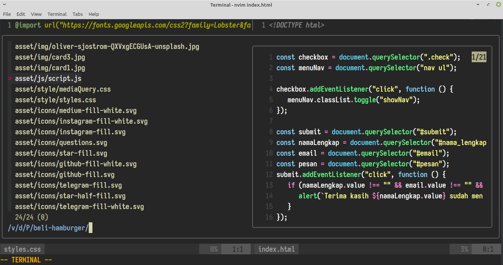

# Setup my personal Neovim

## Vim-Plugin-Manager

1. Vim-Plug
- https://github.com/junegunn/vim-plug

## Plugins

| Name Plugins | Link Plugins | Docs | Link Short Description |
| ------------ | ------------ | ---- | ---------------------- |
| Colorscheme | https://github.com/mhartington/oceanic-next |
| Lightline | https://github.com/mhartington/oceanic-next |
| CHADtree | https://github.com/itchyny/lightline.vim | https://github.com/ms-jpq/chadtree/tree/chad/docs |
| Icons | https://github.com/ryanoasis/vim-devicons |
| Fuzzy Finder / FZF | https://github.com/junegunn/fzf |
| Emmet | https://github.com/mattn/emmet-vim |
| Prettier | https://github.com/prettier/vim-prettier |
| Auto Pairs | https://github.com/jiangmiao/auto-pairs |
| CSS color | https://github.com/gko/vim-coloresque |
| Autocomplete | https://github.com/neoclide/coc.nvim |
| Theme color FZF | https://github.com/sharkdp/bat |
| Commentary Code | https://github.com/tpope/vim-commentary |
| Polygot | https://github.com/sheerun/vim-polyglot |
| Snippets | https://github.com/SirVer/ultisnips | | https://gist.github.com/mfebriann/a9d55a44a50647c3caecbc08c1cd654b |
| Multiple cursor | https://github.com/terryma/vim-multiple-cursors |

## Other Source

| Name | Link | Link Short Description |
| ---- | ---- | ---------------------- |
| Colorscheme FZF / Fuzzy Finder | https://github.com/junegunn/fzf/wiki/Color-schemes | https://gist.github.com/mfebriann/29263ae9314d0244335e98d138b3b6a5 |
| Mapping switch between tabs | https://superuser.com/questions/410982/in-vim-how-can-i-quickly-switch-between-tabs | https://gist.github.com/mfebriann/b1d1a8462a9bec506511d6dd97f9bd2e |
| Shifting blocks visually | https://vim.fandom.com/wiki/Shifting_blocks_visually#Mappings |
| Colorscheme left panel FZF | https://github.com/junegunn/fzf/wiki/Color-schemes | 

## Controls / Commands

| Commands | Descriptions | Modes |
| -------- | ------------ | ----- |
| `Ctrl` + `b` | Open CHADtree | Normal Mode |
| `Ctrl` + `f` | Focus CHADtree | Normal Mode |
| `Ctrl` + `e` | Find files with FZF | Normal Mode |
| `Ctrl` + `g` | Find string / text with FZF | Normal Mode |
| `Ctrl` + `w` | Open new window in right | Normal Mode |
| `Ctrl` + `k` | Move left window | Normal Mode |
| `Ctrl` + `l` | Move right window | Normal Mode |
| `Ctrl` + `s` | Autoformat Prettier | Normal Mode |
| `Ctrl` + `x` | Cut text | Visual Line Mode |
| `Ctrl` + `p` | Paste text | Normal Mode, Visual Mode |
| `Ctrl` + `z` | Undo | Normal Mode |
| `Ctrl` + `c` | Copy text | Visual Mode |
| `Ctrl` + `a` | Select all text | Normal Mode |
| Press double comma `,,` | Stucture HTML5 | Insert Mode, Normal Mode |
| Automatically add close bracket | Insert Mode |
| `Ctrl` + `Right` | Arrow right keyboard for Next Tabs | Normal Mode |
| `Ctrl` + `Left` | Arrow left keyboard for Previous Tabs | Normal Mode |
| `\1`, `\2`, `\3`, `\4`, .... | Switch tabs order with number | Normal Mode |
| `\0` | Siwtch last tabs | Normal Mode |
| `\c` | Give commentar one line | Normal Mode |
| `Ctrl` + `\` | Give commentar select text | Normal Mode, Visual Mode |
| `\h` | Hide code select with fold | Visual Mode |
| `\s` | Show code select with fold | Visual Mode |
| `Ctrl` + `x` | Next tab snippets | Insert Mode |
| `Ctrl` + `z` | Previous tab snippets | Insert Mode |
| `Ctrl` + `n` | Select cursor and next select text | Normal mode |
| `Ctrl` + `x` | Skip the next cursor select | Normal Mode |
| `Ctrl` + `p` | Previous select cursor | Normal Mode |

 

## Notes

1. Rename file or directory with nvim or vim
- `\ls | nvim -` or `\ls | vim -` 
  - change with command mv, then save with command `:w !sh` then `q!`
2. Directory configuration snippets `Ultisnips`
3. How to check map-overview map-modes, `:h map.txt`
4. How to check key-notation `:h key-notation`
5. Load session project being worked on `mksession nameFile.vim` example: `mksession testProject.vim`, then to load it using `nvim` or `vim`, example: `nvim -S testProject.vim`

## Preview

